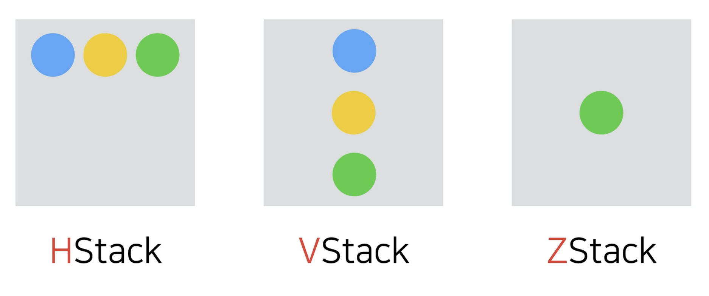

# Stack

StackView는 기본적으로 스크롤을 지원하지 않는다.

## Stack의 종류



- **HStack**
    - Leading > Trailing 수평으로 배치 (단, 아랍권의 나라 같은 경우 Leading이 오른쪽)
- **VStack**
    - Top > Bottom 수직으로 배치
- **ZStack**
    - 화면을 보는 시선의 방향으로 배치

HStack과 VStack과는 다르게 ZStack은 z축을 기준으로 배치하기 때문에 spacing의 개념이 없다.

## LazyStacks
StackView 는 모든 뷰를 동시에 생성하며, LazyStackView는 필요한 시점에 생성한다.

```swift
struct  Sections: View {
    var body: some View {
        ScrollView {
            LazyVStack(pinnedViews: [.sectionHeaders]) {
                Section {
                    EmojiView(emoji: "😀")
                    EmojiView(emoji: "😍")
                    EmojiView(emoji: "😎")
                } header: {
                    SectionHeaderView(title: "Emotions")
                }

                Section {
                    EmojiView(emoji: "🐶")
                    EmojiView(emoji: "🐱")
                    EmojiView(emoji: "🐯")
                } header: {
                    SectionHeaderView(title: "Animals")
                }

                Section {
                    EmojiView(emoji: "🍎")
                    EmojiView(emoji: "🍌")
                    EmojiView(emoji: "🍓")
                } header: {
                    SectionHeaderView(title: "Fruits")
                }
            }
            .frame(maxWidth: .infinity)
        }
    }
}

struct  EmojiView: View {
    let emoji: String
    var body: some View {
        Text("\(emoji)")
            .font(.system(size: 100))
            .frame(width: 150, height: 150)
            .background(.gray.opacity(0.3))
            .clipShape(Circle())
    }
}

struct  SectionHeaderView: View {
    let title: String
    
    var body: some View {
        HStack {
            Text(title)
                //.foregroundColor(.white)
                .font(.title3)
            
            Spacer()
        }
        .padding()
        .frame(maxWidth: .infinity)
        //.background(.blue)
    }
}
```
