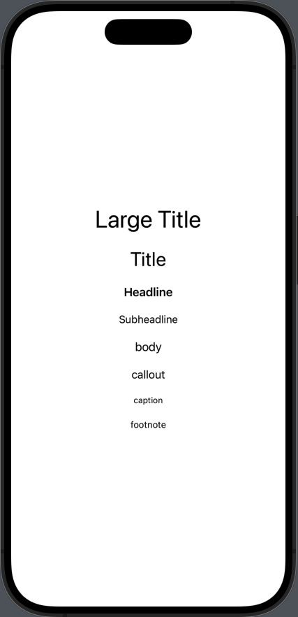

# Font

Font를 다루는 다양한 방법에 대해 공부합니다.
- Standard Text Styles 
- Font Designs
- Size and Weight
- Font Styles

### Standard Font Style



```swift
struct StandardTextStyle: View {
    var body: some View {
        VStack(spacing: 20) {
            Text("Large Title")
                .font(.largeTitle)
              
            Text("Title")
                .font(.title)
              
            Text("Headline")
                .font(.headline)
              
            Text("Subheadline")
                .font(.subheadline)
              
            Text("body")
                .font(.body)
              
            Text("callout")
                .font(.callout)
              
            Text("caption")
                .font(.caption)
              
            Text("footnote")
                .font(.footnote)
        }
    }
}
```

## Font
- SwiftUI의 Font 구조체는 Apple Platform을 모두 지원 하고, Runtime에 System 기본 폰트를 자동으로 선택해 사용한다. Standard Font Style을 지원한다.
